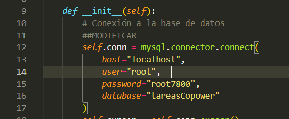
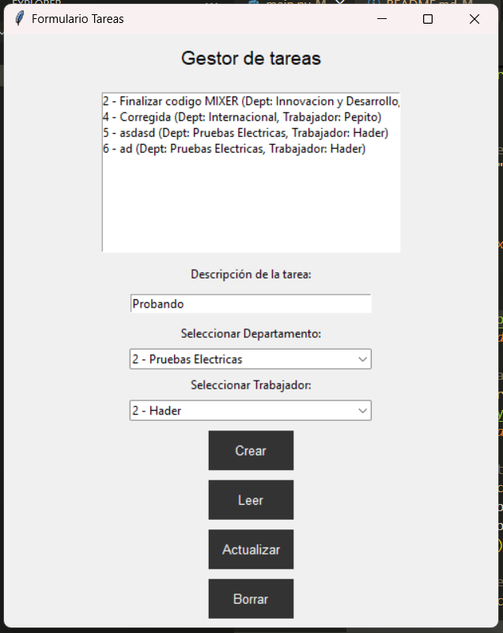

### Hader Cabrera

Fecha: 29/11/2024

---

## Proyecto de escritorio para gestion de tareas.

>**Tecnologias implementadas**
1. python
2. Tkinder
3. MySQL

>**Dependencias instaladas**

```
pip install mysql-connector-python
```

> **Configuraciones MySQL**

1. DML Y DDL para MySQL:
    ```
    CREATE DATABASE tareasCopower;

    USE tareasCopower;

    CREATE TABLE departamento (
        id INT AUTO_INCREMENT PRIMARY KEY,
        nombre VARCHAR(50) NOT NULL
    );

    CREATE TABLE trabajador (
        id INT AUTO_INCREMENT PRIMARY KEY,
        nombre VARCHAR(50) NOT NULL,
        id_departamento INT,
        FOREIGN KEY (id_departamento) REFERENCES departamento(id)
    );

    CREATE TABLE tarea (
        id INT AUTO_INCREMENT PRIMARY KEY,
        descripcion VARCHAR(255) NOT NULL,
        id_trabajador INT,
        FOREIGN KEY (id_trabajador) REFERENCES trabajador(id)
    );

    ```
    ```
    INSERT INTO departamento (id,nombre) VALUES 
    (1, "Innovacion y Desarrollo"), 
    (2,"Pruebas Electricas"), 
    (3, "Internacional");
    INSERT INTO trabajador (id,nombre,id_departamento) VALUES 
    (1,"Athur",1),(2,"Hader",2),(3,"Pepito",3);
    ```
2. Configuracion de la conexion [**Linea 15**]
    <figure>
    <figcaption class= "center-text"><i>Config py/MySQL</i></figcaption>
    
    </figure>


> **Imagen final de la interfaz Tkinter**
<figure>
<figcaption class= "center-text"><i>Imagen final de la aplicacion de escritorio.</i></figcaption>

</figure>

> **Analisis con SonarQube**

Se genero el analisis desde terminal con el siguiente codigo:
```
sonar-scanner.bat -D"sonar.projectKey=task_manager" -D"sonar.sources=." -D"sonar.host.url=http://localhost:9000" -D"sonar.token=sqp_211fe1c855f19e11da93e07ef3c5928ff61f96fb"
```
[Ver informe en PDF](/task_manager_SonarQube.pdf)
